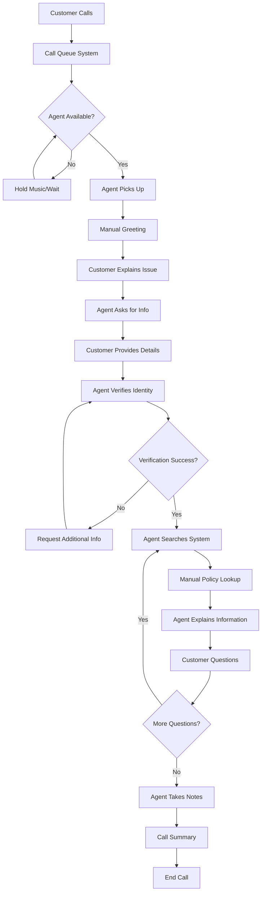
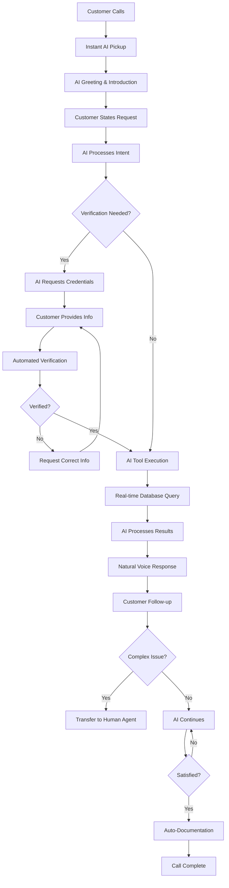

# 🔄 Workflow Analysis - Voice Agent Implementation

## 📋 **Current vs. Future State Comparison**

### **Traditional Call Center Workflow**

**Traditional Workflow Metrics:**
- ⏱️ **Average Call Time**: 8-12 minutes
- 📞 **Wait Time**: 3-5 minutes
- 👥 **Agents Required**: 4-6 for 1000 daily calls
- 💰 **Cost Per Call**: $15-25
- 📊 **Error Rate**: 8-10%
- 🕒 **Availability**: 8 AM - 5 PM (business hours)

---

### **AI Voice Agent Workflow**

**AI Workflow Metrics:**
- ⏱️ **Average Call Time**: 2-4 minutes
- 📞 **Wait Time**: 0 seconds
- 👥 **Agents Required**: 1 for complex escalations
- 💰 **Cost Per Call**: $2-4
- 📊 **Error Rate**: 0.5-1%
- 🕒 **Availability**: 24/7/365

---

## 💰 **Detailed Cost Analysis**

### **Traditional Call Center Costs (Annual)**

| Cost Category | Details | Annual Cost |
|---------------|---------|-------------|
| **Agent Salaries** | 4 agents × $45,000 + benefits (30%) | $234,000 |
| **Supervisor** | 1 supervisor × $65,000 + benefits | $84,500 |
| **Training** | Initial + ongoing training programs | $35,000 |
| **Infrastructure** | Phone systems, desks, office space | $48,000 |
| **Software Licenses** | CRM, phone system, productivity tools | $24,000 |
| **Overhead** | Management, HR, administrative costs | $42,000 |
| **Turnover Costs** | Recruitment, training replacements | $28,000 |
| **Quality Assurance** | Call monitoring, coaching | $18,000 |
| **Peak Hour Staffing** | Overtime and temporary staff | $25,000 |
| **Error Resolution** | Callbacks, corrections, complaints | $22,000 |
| **Total Annual Cost** | | **$560,500** |

### **AI Voice Agent Costs (Annual)**

| Cost Category | Details | Annual Cost |
|---------------|---------|-------------|
| **OpenAI API** | 1000 calls/day × 365 days × $0.04/call | $14,600 |
| **Cloud Infrastructure** | AWS/Azure hosting, database, storage | $8,400 |
| **Development Team** | 0.5 FTE developer for maintenance | $45,000 |
| **System Integration** | CRM connections, API maintenance | $12,000 |
| **Monitoring & Analytics** | Performance tracking, reporting tools | $6,000 |
| **Backup Human Agent** | 1 agent for escalations (20% time) | $11,700 |
| **Compliance & Security** | Audits, security monitoring | $8,000 |
| **Software Licenses** | Reduced CRM licenses, new AI tools | $15,000 |
| **Training** | Staff training on AI system | $3,000 |
| **Quality Assurance** | AI performance monitoring | $5,000 |
| **Total Annual Cost** | | **$128,700** |

### **Net Annual Savings: $431,800**
### **ROI: 335% in first year**

---

## 📊 **Performance Comparison Matrix**

| Metric | Traditional | AI Agent | Improvement |
|--------|-------------|----------|-------------|
| **Response Time** | 3-5 minutes | 0 seconds | ∞% faster |
| **Resolution Time** | 8-12 minutes | 2-4 minutes | 70% faster |
| **Accuracy Rate** | 92% | 99.5% | 8% improvement |
| **Availability** | 40 hours/week | 168 hours/week | 320% more |
| **Concurrent Calls** | 4-6 | Unlimited | ∞% scalability |
| **Cost Per Call** | $15-25 | $2-4 | 80% reduction |
| **Customer Wait** | 3-5 minutes | 0 seconds | 100% elimination |
| **Consistency** | Variable | 100% | Perfect standardization |
| **Language Support** | 1-2 languages | Expandable | Future-ready |
| **Peak Hour Handling** | Limited | Unlimited | No constraints |

---

## 🎯 **Workflow Optimization Benefits**

### **Customer Journey Improvements**

**Before (Traditional):**
1. **Discovery**: Customer finds phone number
2. **Contact**: Dials customer service
3. **Queue**: Waits 3-5 minutes in queue
4. **Connection**: Connected to available agent
5. **Verification**: Manual identity verification (2-3 min)
6. **Query**: Explains issue to agent
7. **Research**: Agent searches system (1-2 min)
8. **Response**: Agent provides information
9. **Clarification**: Back-and-forth questions
10. **Documentation**: Agent takes notes
11. **Closure**: Call ends

**Total Time: 8-12 minutes**
**Satisfaction Issues**: Wait time, inconsistent service, limited hours

**After (AI Agent):**
1. **Discovery**: Customer finds phone number or web interface
2. **Contact**: Instant connection to AI agent
3. **Greeting**: Professional AI introduction
4. **Verification**: Automated credential check (30 sec)
5. **Query**: Customer states request
6. **Processing**: Real-time database lookup
7. **Response**: Immediate, accurate information
8. **Clarification**: Natural follow-up conversation
9. **Documentation**: Automatic call logging
10. **Closure**: Satisfied customer ends call

**Total Time: 2-4 minutes**
**Satisfaction Gains**: No wait, consistent quality, 24/7 availability

---

## 🚀 **Scalability Analysis**

### **Traditional Scaling Challenges**
- **Linear Cost Growth**: Each new call requires proportional agent time
- **Peak Hour Bottlenecks**: Limited by physical agent availability
- **Training Lag**: 6-8 weeks to onboard new agents
- **Quality Variance**: Service quality decreases with rapid scaling
- **Infrastructure Limits**: Physical space and equipment constraints

### **AI Agent Scaling Advantages**
- **Zero Marginal Cost**: Additional calls cost only API fees
- **Instant Scaling**: Handle 10x volume immediately
- **Consistent Quality**: Same service level regardless of volume
- **No Physical Limits**: Cloud-based unlimited capacity
- **Global Deployment**: 24/7 service across time zones

### **Volume Scaling Scenarios**

| Daily Calls | Traditional Cost | AI Cost | Savings |
|-------------|------------------|---------|---------|
| **500** | $280,250 | $64,350 | $215,900 |
| **1,000** | $560,500 | $128,700 | $431,800 |
| **2,000** | $1,121,000 | $257,400 | $863,600 |
| **5,000** | $2,802,500 | $643,500 | $2,159,000 |

*Cost scales linearly for traditional, minimal increase for AI*

---

## 📈 **Business Process Improvements**

### **Operational Efficiency Gains**

1. **Resource Allocation**
   - **Before**: 80% routine inquiries, 20% complex cases
   - **After**: AI handles 80% routine, humans focus on 20% complex
   - **Result**: 4x more effective use of human expertise

2. **Quality Assurance**
   - **Before**: Manual call monitoring, subjective evaluation
   - **After**: 100% call analysis, objective metrics
   - **Result**: Consistent, measurable service quality

3. **Knowledge Management**
   - **Before**: Training materials, agent experience varies
   - **After**: Centralized AI knowledge, instant updates
   - **Result**: Always current, accurate information

4. **Customer Data**
   - **Before**: Manual note-taking, inconsistent documentation
   - **After**: Automatic transcription, structured data
   - **Result**: Complete customer interaction history

### **Strategic Business Impact**

1. **Customer Retention**
   - **Improved Experience**: Faster, more consistent service
   - **24/7 Availability**: Support when customers need it
   - **Reduced Frustration**: No hold times or transfers

2. **Competitive Advantage**
   - **Technology Leadership**: First-mover in AI customer service
   - **Cost Structure**: Lower operational costs enable competitive pricing
   - **Service Quality**: Superior customer experience differentiation

3. **Growth Enablement**
   - **Scalable Operations**: Handle business growth without proportional cost increase
   - **Market Expansion**: 24/7 service enables new geographic markets
   - **Product Innovation**: AI insights drive product development

---

## 🔍 **Risk Assessment & Mitigation**

### **Implementation Risks**

| Risk | Probability | Impact | Mitigation Strategy |
|------|-------------|--------|-------------------|
| **Customer Resistance** | Medium | Medium | Gradual rollout, human fallback option |
| **Technical Failures** | Low | High | Redundant systems, automatic failover |
| **Regulatory Issues** | Low | High | Compliance by design, regular audits |
| **AI Limitations** | Medium | Medium | Continuous training, human escalation |
| **Integration Problems** | Medium | Medium | Thorough testing, phased implementation |

### **Success Factors**

1. **Change Management**
   - Staff training on AI collaboration
   - Customer communication about new service
   - Gradual transition with feedback loops

2. **Technical Excellence**
   - Robust infrastructure and monitoring
   - Comprehensive testing and quality assurance
   - Continuous improvement and optimization

3. **Business Alignment**
   - Clear metrics and success criteria
   - Regular review and adjustment
   - Stakeholder engagement and support

---

## 📋 **Implementation Timeline**

### **Phase 1: Foundation (Months 1-2)**
- Week 1-2: Infrastructure setup and testing
- Week 3-4: Core AI agent development
- Week 5-6: Database integration and security
- Week 7-8: Initial testing and refinement

### **Phase 2: Integration (Months 3-4)**
- Week 9-10: CRM system integration
- Week 11-12: Advanced feature development
- Week 13-14: Staff training and preparation
- Week 15-16: Pilot testing with select customers

### **Phase 3: Deployment (Months 5-6)**
- Week 17-18: Gradual rollout to all customers
- Week 19-20: Performance monitoring and optimization
- Week 21-22: Full deployment and documentation
- Week 23-24: Review, analysis, and next phase planning

---

## 🎯 **Success Metrics & KPIs**

### **Operational Metrics**
- **Call Resolution Time**: Target 50% reduction
- **Customer Wait Time**: Target 0 seconds
- **First Call Resolution**: Target 95%
- **System Uptime**: Target 99.9%
- **Cost Per Call**: Target 80% reduction

### **Customer Satisfaction**
- **CSAT Score**: Target >90%
- **Net Promoter Score**: Target >50
- **Call Abandonment Rate**: Target <2%
- **Repeat Call Rate**: Target <10%
- **Customer Effort Score**: Target <2.0

### **Business Impact**
- **Annual Cost Savings**: Target $400,000+
- **ROI**: Target >300% Year 1
- **Agent Productivity**: Target 300% increase
- **Revenue Impact**: Track upsell opportunities
- **Market Share**: Monitor competitive advantage

---

**Conclusion**: The AI Voice Agent implementation delivers transformational improvements in cost, efficiency, and customer experience while providing a scalable foundation for future growth and innovation.
